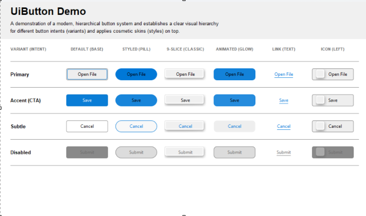

# U++ UI Controls (experimental)

Early pass at a modern control layer for Ultimate++ – starting with a single, UiButton class to flush out API and concept.

> Snapshots:



---

## What’s in the box right now

- `Ui/UiButton` – a new button control:
  - Semantic styles: **default**, **accent**, **subtle**, **link**.
  - Icon support with layout control: left / right / top / bottom.
  - Access keys (`&X`), focus handling, keyboard activation.
  - Consistent `GetMinSize()` that respects label, icon and user min size.
- `Ui/UiStyle` – small styling “engine”:
  - `StyledPalette` (face / frame / ink per state).
  - `StyledMetrics` (radius, frame width, dashed borders, fonts).
  - `StyledSkin` (9-slice image skinning).
  - `CtrlStyled<T>` mixin for future controls.
- `Ui/UiDraw` – shared drawing helpers:
  - `UiPaintFaceFrameDash` – rounded / dashed / AA frame + fill.
  - `UiPaintFocusRing` – state-aware focus outline.
  - `UiPaintPulseRing` (demo only) – expanding highlight ring.
- `examples/UiButtonDemo` – a demo window showing:
  - Variants: primary, accent, subtle, disabled.
  - Columns: base, pill, 9-slice, animated, link, icon-left.

This is **not** a drop-in replacement for CtrlLib but I will slowly work through all the controls. 
The concept presented here is how I feel the front facing API specifically for design and animation should feel , this is not random thoughts but carefully considered each aspect of it so that this particular button class is well conceived, I've added additional cleanup and re-factoring, trying to maintain some of the existing CtrlLib concepts especially in regards to chameleon styling and trying to unify SetMinSize().

---

## Why another button?

Short version: the old one is solid, but I wanted:

- **Forward-facing styling**  
  Styles you can poke at in code (`SetBaseColors`, `SetRadius`, 9-slice, etc.) instead of everything living in Chameleon magic.
- **Semantic presets, not hard-coded roles**  
  Instead of “OK”/“Cancel” special cases tied into the button itself, there are semantic styles: **Accent**, **Subtle**, **Link** built on the same `Style`.
- **Icons that behave like modern UI**  
  Icon left / right / top / bottom, anchored so they don’t jitter when labels change.
- **Animation hooks without subclass hell**  
  A generic `Animate<T>` helper and paint callbacks (`WhenPaintBackground` / `WhenPaintForeground`) so you can do glow, pulse, and other tricks without forking the control.

This is the template for future `Ui*` controls that will follow, so it’s intentionally a bit “extra love”.

---

## Layout of the repo

Rough structure:

- `Ui/`
  - `Ui.h` – umbrella include.
  - `UiStyle.h` – types + `CtrlStyled<T>` mixin.
  - `UiDraw.h` – shared drawing helpers.
  - `UiButton.h / UiButton.cpp` – the control itself.
- `Animation/`  
  - Local copy / dependency for the animation helper.
- `examples/UiButtonDemo/`
  - `main.cpp` – the demo window that wires everything together.

---

## Building & running

Minimal path to see something on screen:

1. Open the repository in **TheIDE**.
2. Make sure the `Ui` package is in a nest/assembly that also sees:
   - `Core`, `Draw`, `CtrlCore`, `CtrlLib`, `Painter`, `Animation`(From UppHub).
3. Build and run: `examples/UiButtonDemo`.

If your U++ setup already builds the standard examples, this should behave the same way – just one more package in the tree.

---

## Playing with it

A few knobs worth trying:

- **Semantic styles**
```cpp
  btn.SetAccentStyle();   // blue-ish, CTA style
  btn.SetSubtleStyle();   // border-only, quieter text
  btn.SetLinkStyle();     // underline, highlight ink, no frame
```

* **Icon layout**

```cpp
  btn.SetImage(icon);
  btn.SetImageLayout(UIIMAGE_LEFT);   // or UIIMAGE_RIGHT / TOP / BOTTOM
```

* **Direct styling**

```cpp
  btn.SetBaseColors(SColorHighlight(), SColorHighlight(), SColorText())
     .SetRadius(DPI(20));             // pill button
```

* **Animation (demo)**
  In the demo, the animated column shows:

  * background color pulsing via `Animate<Color>`,
  * a soft “glow” ring via `WhenPaintForeground` + `UiPaintPulseRing`.

This is intentionally a bit opinionated so you can get a feel for the direction, not a final API contract.

---

## Status & intent

* API **will** change. Names, enum values, maybe even the `Style` layout.
* Behaviour is tuned for what I’m seeing on current Windows/macOS-style UIs, not legacy themes.
* Goal is to establish a **repeatable pattern** for `Ui*` controls:

  * Styling via `Style` + `CtrlStyled<T>`.
  * Shared drawing helpers.
  * Animation hooks.
  * Sensible defaults that still respect the U++ way of doing things.

If you’re a U++ dev poking at this repo, the most useful feedback right now is:

* “This feels right/wrong compared to how I’d use it in an app.”
* “This should be in the style, not the control.”
* “This part needs to be simpler; I don’t want to think about it.”
* “WTF were you thinking!, there is a better way to do this ... [Code here]”


---

## License

Same license as Ultimate++ (intended to live alongside it).
If that ever changes, the README will be the first place it’s written down.

```

---
