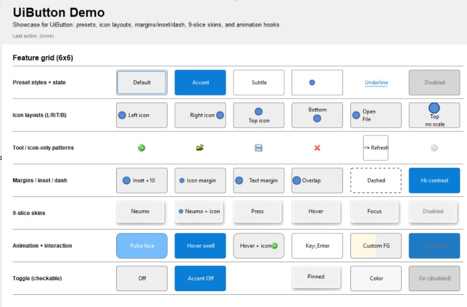
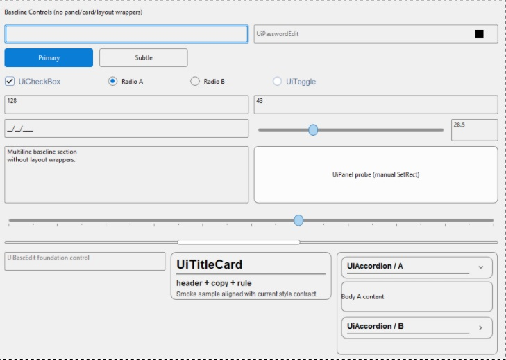
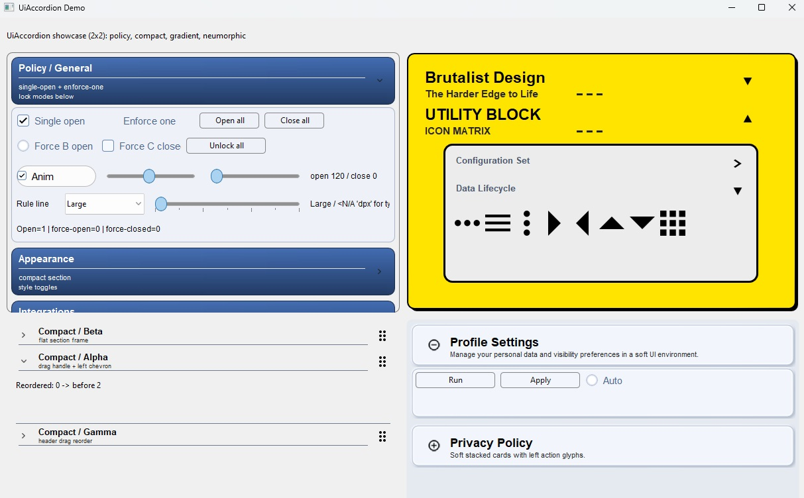
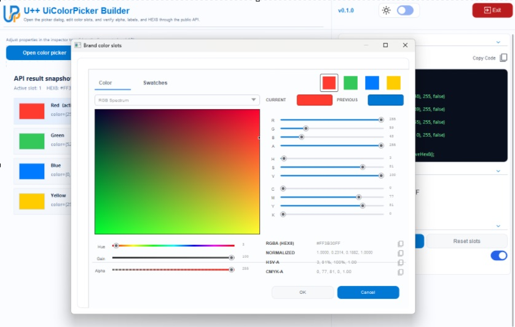
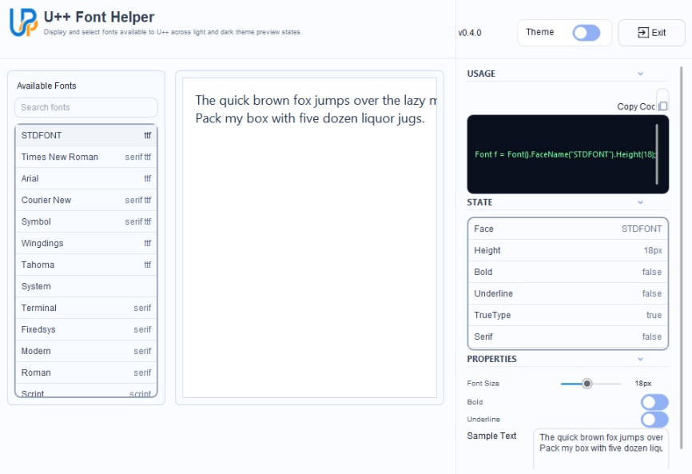
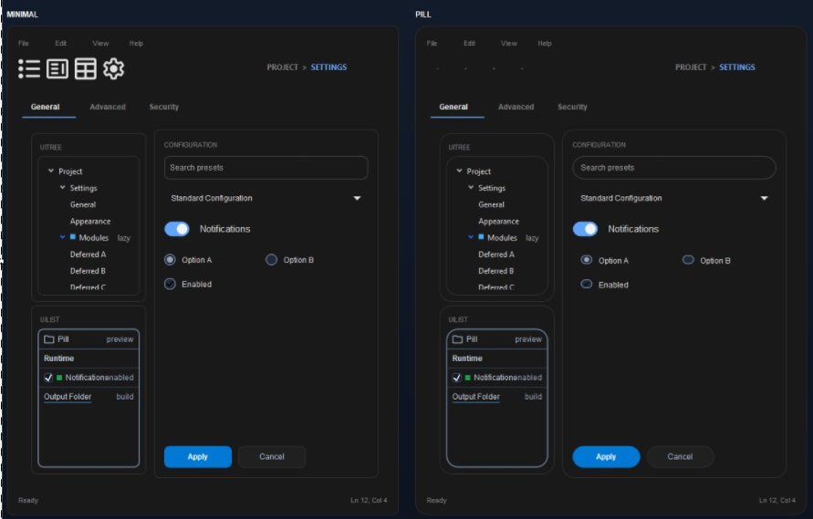
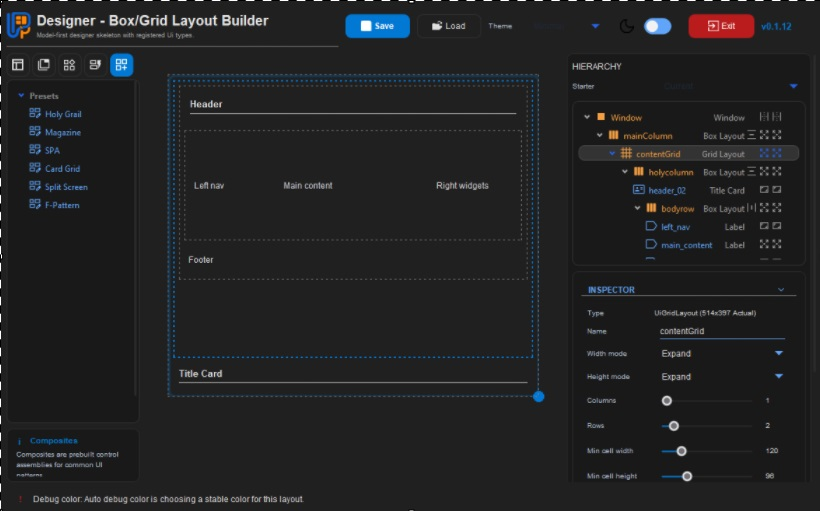

# U++ Ui

Modern, style-first controls and UI helpers for Ultimate++.

This repository is building a cohesive `Ui*` layer that sits alongside CtrlLib and focuses on three things:

- consistent styling through shared palette / metrics / skin structures
- practical reusable controls, layouts, and drawing helpers
- demos that are useful in a WYSIWYG sense, not just showcase windows

The library is still evolving, but it is now far enough along that the main direction is stable: clean themed controls, predictable layout behavior, and demo applications that help both users and AI agents understand how to apply the library in real code.















## Quick links

- `GETTING_STARTED.md` - fast ramp-up
- `UPP_GUIDES/README.md` - engineering guides, architecture notes, and active roadmaps
- `CHANGELOG.md`

## Repo layout

- `Ui/` - the `Ui` package: controls, theme/style infrastructure, layout helpers, icons, and draw utilities
- `examples/` - demos and small test apps; these also act as a manual regression suite
- `Utilities/Designer/` - visual layout/control designer for building and saving UI designs, inspecting generated code, and testing layout behavior

## What the repository provides

The `Ui` package currently covers:

- Theme and style infrastructure
  - `UiStyle`, `UiTheme`, `UiDraw`, `UiIcons`
  - shared palette/metrics/skin styling, icon catalog, and paint helpers

- Layout and composition
  - `UiBoxLayout` - lightweight row/column layout with fit, fixed, and expand semantics
  - `UiGridLayout` - structured grid-style placement for denser UI surfaces
  - `UiSplitter` - two-pane splitter layout with themed thumb and pane sizing
  - `UiQuadSplitter` - four-pane splitter layout for editor-style workspaces
  - `UiStack` - page stack/container for switching between hosted child pages
  - `UiLayoutCursor` - small incremental placement helper for readable manual layout code
  - `UiMeasureLayout` - helper for asking a control how much space it actually wants, which is annoyingly useful

- Text and display controls
  - `UiLabel` - styled text display with selection, alignment, icon/media, and richer presentation options
  - `UiTitleCard` - structured title/subtitle/media header surface
  - `UiBreadcrumbs` - path/navigation display with optional icons and dividers
  - `UiDoc` - rich document display/editor surface for larger formatted text content

- Buttons and toggles
  - `UiButton` - general action button with icon/text layout support
  - `UiToolButton` - compact toolbar/action button
  - `UiCheckBox` - themed boolean box control
  - `UiRadioButton` - themed single-choice option control
  - `UiToggle` - themed switch/toggle control
  - `UiSplitButton` - action button with a secondary popup lane, because one click was too simple
  - `UiMenu` - themed popup action surface

- Panels, containers, and scrolling
  - `UiPanel` - general styled surface with frame, fill, radius, and shadow support
  - `UiGroupPanel` - titled group container with icon/subtitle/side-title header chrome and a single hosted body slot
  - `UiAccordion` - collapsible section container with themed headers and bodies
  - `UiScrollPanel` - themed scrollable content host
  - `UiScrollBar` - standalone themed scrollbar
  - `UiTab` - tabbed navigation surface
  - `UiStack` - stacked page container for multi-view surfaces
  - `UiSliderEdit` - a slider paired with a text field, for when precision refuses to be optional

- Edit and text-entry controls
  - `UiBaseEdit` - shared base for edit controls
  - `UiLineEdit` - single-line text entry
  - `UiPasswordEdit` - masked password entry
  - `UiMaskEdit` - masked formatted text entry
  - `UiMultiEdit` - multi-line text editing
  - `UiIntEdit` - integer entry
  - `UiFloatEdit` - floating-point entry
  - `UiColorPicker` - reusable color picker with numeric channels and swatch workflow

- Selection, data, and navigation controls
  - `UiDropdown` - themed selection dropdown
  - `UiList` - styled flat list with selection and metadata support
  - `UiTree` - styled hierarchical item browser
  - `UiTable` - themed tabular presentation/edit surface
  - `UiDataModels` - reusable data/model helpers used across list, tree, dropdown, and table controls

- Slider, picker, and curve utilities
  - `UiSlider` - themed scalar slider
  - `UiBezierCurveEditor` - interactive curve editor for four-point bezier curves
  - `UiBezierCurveField` - composite field around the curve editor for direct use in apps and demos

- Composite controls
  - `Composites/UiCompositeColor` - color-oriented composite helpers
  - `Composites/UiCompositeDropdown` - dropdown composition helpers
  - `Composites/UiCompositeEdit` - edit composition helpers
  - `Composites/UiCompositeLabel` - label composition helpers
  - `Composites/UiCompositeSlider` - slider composition helpers
  - `Composites/UiCompositeToggle` - toggle composition helpers

- Supporting utility pieces
  - `UiIndicatorBase`, `UiIndicatorSupport` - shared indicator helpers used by several controls
  - `Ui.h` - package umbrella include

## Designer

`Utilities/Designer` is the visual designer for this library. It lets you build a model using layouts, containers, controls, composites, and presets; inspect the hierarchy and sizing modes; save/load designs as JSON; and view generated U++ code while testing layout behavior in the preview.

The Designer currently supports the same core layout concepts used by the controls: fit, fixed, and expand sizing; box/grid placement; box wrapping and snap flow; spacers; splitters; panel, group-panel, and scroll-panel hosting; tab/stack containers; theme roles; and reusable layout presets.


## Intended role of the demos

The demos are meant to be practical reference tools, not only visual showcases.

Examples:

- `UiPanelDemo` acts like a small panel builder that lets a user tune properties and copy the generated code
- `UiFontSelectorDemo` is a useful font helper that previews installed fonts and shows the exact font-construction call
- `UiDemoBase` is the shell/template reference for how demo windows are structured and styled

The current demo direction is to make each demo useful on its own while still exposing the implementation patterns behind the control. The active builder demos share one shell contract: header/title/subtitle/logo, version pill, theme toggle, red exit pill, dotted preview canvas, and Usage -> State -> Properties inspectors with live code output.

Recent rewrites on that path include UiMultiEditDemo, UiRadioButtonDemo, UiMenuDemo, and UiTabDemo, each updated to surface the full control-specific behavior/layout/color seams rather than only a narrow showcase subset.

## Example/demo inventory

The `examples/` directory currently includes:

- `UiDemoBase` - shared demo shell/template reference
- `UiAccordionDemo`, `UiPanelDemo`, `UiFontSelectorDemo`, `UiThemeDemo`
- `UiButtonDemo`, `UiToolButton` behavior is represented in the button-oriented demos
- `UiLabelDemo`, `UiTitleCardDemo`, `UiBreadcrumbsDemo`
- `UiBoxLayoutDemo`, `UiGridLayoutDemo`, `UiSplitterDemo`, `UiScrollPanelDemo`, `UiScrollBarDemo`
- `UiBaseEditDemo`, `UiLineEditDemo`, `UiPasswordEditDemo`, `UiMaskEditDemo`, `UiMultiEditDemo`, `UiIntFloatDemo`
- `UiDropdownDemo`, `UiListDemo`, `UiTreeDemo`, `UiTableDemo`, `UiMenuDemo`, `UiTabDemo`
- `UiCheckBoxDemo`, `UiRadioButtonDemo`, `UiToggleDemo`
- `UiColorPickerDemo`, `UiDocDemo`, `UiOsFileDialogDemo`

## Build and run

Important:

- `Ui` is a library package, not a runnable main package.
- Do not select `Ui` itself as the main package in TheIDE.
- Use one of the packages under `examples/` as the runnable main package.

### TheIDE

1. Open the repository in TheIDE.
2. Ensure your assembly/nests can see both:
   - this repo, for `Ui` and `examples`
   - U++ `uppsrc`, for `Core`, `Draw`, `CtrlLib`, and related packages
3. Set a demo package as the main package and run that package, for example `examples/UiPanelDemo`, `examples/UiFontSelectorDemo`, or `examples/UiButtonDemo`.

Dependencies used by `Ui/Ui.upp` include `Painter` and `Animation`.

Note: `Animation` should resolve from the external `E:\apps\github\upp_AnimationEasing` nest, not from a local package inside this repository.

### CLI with `umk`

Example on Windows:

```bat
"E:\upp-18468\umk.exe" "E:\apps\github\upp_Ui\examples,E:\apps\github\upp_Ui,E:\apps\github\upp_AnimationEasing,E:\upp-18468\uppsrc" UiButtonDemo CLANGx64 --out-dir "E:\apps\github\upp_Ui\out" -br "E:\apps\github\upp_Ui\out\UiButtonDemo.exe"
```

For this repository, prefer the checked-in `GitHubOut.var` assembly when doing
local development. It includes the `E:\apps\github\upp_AnimationEasing` nest
required by `Ui/Ui.upp` and writes intermediates to
`E:\apps\github\upp_Ui\out`, avoiding locked/shared objects under
`E:\upp-18468\out`.

Keep ad-hoc CLI build artifacts in the repository `out` root
(`E:\apps\github\upp_Ui\out`). Do not place current demo/designer outputs in
`build` or `bin`.

## Public API direction

This is a new codebase with no backward-compat naming shim layer. Public names are being kept explicit and direct, and docs/demos are updated with the code.

Spacing conventions used across item-oriented controls:

- `item_spacing` means spacing between repeated owned items
- `content_gap` means primary spacing inside one control/item surface
- semantic secondary gaps stay explicit, for example `right_gap`, `metadata_gap`, `drag_gap`, `chevron_gap`
- `content_margin` is the outer inset around painted content
Current conventions used across the controls and demos:

- interactive selection controls expose `SetData()` / `GetData()`
- selection notifications use `WhenSelection`
- `UiTab` uses `SetActiveTab()` / `GetActiveTab()`
- `UiDropdown` uses explicit model binding via `SetModel(UiListModel&)`, `UseInternalModel()`, and `GetInternalModel()`
- numeric edits keep one vocabulary: `Min`, `Max`, `MinMax`, `Step`, `Precision`, `NotNull`
- `UiAccordion` section accessors are `GetSectionContent()`, `GetSectionHeader()`, and `GetSectionBody()`
- custom-painted primitive parts use dedicated hooks rather than outer overpaint:
  - `UiSlider`: `WhenPaintTrack`, `WhenPaintActiveTrack`, `WhenPaintThumb`
  - `UiScrollBar`: `WhenPaintTrack`, `WhenPaintThumb`, `WhenPaintArrow`
  - `UiToggle`: `WhenPaintTrack`, `WhenPaintThumb`

Minimal button usage:

```cpp
UiButton b;
b.SetText("Run")
 .SetIcon(CtrlImg::go_forward())
 .SetIconSide(UiAlign::LEFT)
 .SetStyle(UiTheme::ResolveButton(UiButtonRole::Accent));
```

## Current status

The project is still under active refinement, especially around:

- demo quality and usefulness
- final polish of default styles
- ensuring new controls stay clean, documented, and low-bloat in usage

The overall direction is no longer just exploratory. The controls, helpers, and demos are being shaped into a usable styled UI layer for real Ultimate++ applications.

## License

Intended to live alongside Ultimate++.

